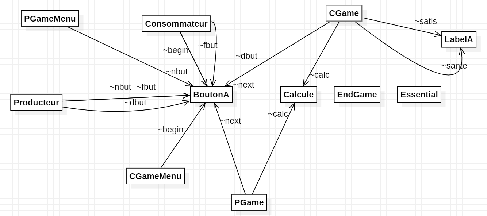

# Cahier des chages

## Description des objectifs pédagogiques du jeu

L’importance de la consommation en temps de crise.

## Description des objectifs pédagogiques

Comprendre l’évolution des prix en fonction des habitudes de consommation
-Plus on consomme, moins c’est cher et moins on consomme, plus c’est cher.
Comprendre l’importance de la consommation en temps de crise
-Moins l’on consomme, plus les entreprises sont en difficulté

## Description du jeu

-Type de jeu : Gestion
-Incarnation du joueur : La tendance ou se que la majorité des consommateurs fonts des consommateurs ou une entreprise

### Déroulement d’une partie

Description du déroulement d’une partie : début, déroulement et fin
La partie commence par le choix d’acteur de la crise, puis ensuite, le jeu consiste en une suite de choix à faire par le joueur où à chaque tour, le joueur peut choisir ou mettre son argent. Dans une épargne ou dans des dépenses. 
Quand la partie s'achève on affiche un message indiquant si l’on a gagné.

### Paramétrage d’une partie

Description des options permettant de paramétrer une partie.
- Choix entre consommateur et producteur
- Choix d’une crise

## Modèle conceptuel applicatif

## Description des fonctionnalités 

### Actions du joueur

- Gestion des tours
    - Valider : Valider les action du tour et passer au tour suivant
- Gestion des ressources
    - Attribuer : Attribuer les fonds la ou le joueur le veut
- Gestion des prix
    - Attribuer : Attribuer les prix des produits
- Gestion des Quantités
    - Attribuer : Attribuer les quantités de produits vendu
- Choix du rôle
    - Choisir: Choisir le rôle du joueur
### Informations au joueur

- Gestion des jours
    - NombreJoursTotal : nombre de tours total du jeu
- JourActuel : tour actuel
    - Gestion des ressources
- Secteur: la listes des secteur du marché
    - Fonds: les fonds disponibles
- Gestion des prix
    - Secteur: la listes des secteur du marché
- Fonds: les fonds disponible dans les différents march
    - Gestion des consomateurs
- satisfaction: le bonheur que les gens ressentent
    - santé: leurs état de santé 
- Gestion du secteur d’activité
    - prix: le prix de vente des produits dans le secteur d’activité
- quantité: la quantitée que l’on produit pour la journée
    - qualité: la qualité des produits vendu 
### Moteur interne
Liste des interactions entre les actions du joueurs et les informations  
- Gestion des tours
    - Valider : 
        - JourActuel++
        - calcule des fonds disponible, de la santé, du moral des prix
        - Allocation des ressources 
        - Attribuer : modifier les revenus que l’on met dans tel secteur d’activité.
        - Choix du prix 
        - Attribuer : définir un prix à ses produits pour la journée.
- Choix de la qualité 
    - Attribuer : définir une qualitée à ses produits pour la journée.

- Choix de la quantitée
    - Attribuer : définir une quantitée de produit préparée pour la journée
## Scénarios
### Scénario tutorial
Tutorial pour comprendre l’importance de la consommation en temps de crise
- Paramètres :
    - difficulté: 1
    - argent: 15000
    - jour: 0/60
    - santé: 90/100
    - satisfaction: 70/100
- Déroulement gagnant :
- le joueur choisit de donner 40 euros en loisir et 45 en alimentation
    - [argent=15000]
    - [difficulté: 1]
    - [jour: 0]
    - [santé: 88]
    - [satisfaction: 75]

- le joueur choisit de donner 40 euros en loisir et 60 en alimentation
    - [argent=14897]
    - [difficulté: 1]
    - [jour: 1]
    - [santé: 88]
    - [satisfaction: 81]
…

- le joueur choisit de donner 30 euros en loisir et 60 en alimentation
    - [argent=14672]
    - [difficulté: 1]
    - [jour: 5]
    - [santé: 88]
    - [satisfaction: 99]

- un pop up apparaît pour dire qu’il y a une crise
Le joueur choisit de donner 30 euros en loisir et 60 en alimentation
    - [argent=13968]
    - [difficulté: 1]
    - [jour: 15]
    - [santé: 95]
    - [satisfaction: 100]

- Le joueur choisit de donner 30 euros en loisir et 60 en alimentation
    - [argent=13968]
    - [difficulté: 1]
    - [jour: 16]
    - [santé: 95]
    - [satisfaction: 100]
- Le joueur choisit de donner 39 euros en loisir et 60 en alimentation
    - [argent=4788]
    - [difficulté: 1]
    - [jour: 60]
    - [santé: 100]
    - [satisfaction: 100]
Le joueur gagne car il est toujours en vie, sa satisfaction n’atteint pas 0, son argent est supérieur à -500  
et cela sur une période de 60 jours.
- Paramètres :
    - difficulté: 1
    - argent: 15000
    - jour: 1
    - santé: 90
    - satisfaction: 70
    - Déroulement perdant :
- le joueur choisit de donner 50 euros en loisir et 0 en alimentation
    - [argent=15000]
    - [difficulté: 1]
    - [jour: 1]
    - [santé: 100]
    - [satisfaction: 90]
- le joueur choisit de donner 50 euros en loisir et 0 en alimentation
    - [argent=14935]
    - [difficulté: 1]
    - [jour: 2]
    - [santé: 80]
    - [satisfaction: 81]
- le joueur choisit de donner 50 euros en loisir et 0 en alimentation
    - [argent=14885]
    - [difficulté: 1]
    - [jour: 3]
    - [santé: 77]
    - [satisfaction: 87]
- le joueur choisit de donner 44 euros en loisir et 0 en alimentation
    - [argent=14845]
    - [difficulté: 1]
    - [jour: 4]
    - [santé: 74]
    - [satisfaction: 92]
…

- le joueur choisit de donner 44 euros en loisir et 0 en alimentation
    - [argent=12309]
    - [difficulté: 1]
    - [jour: 28]
    - [santé: 2]
    - [satisfaction: 100]

Le joueur perd car il est mort avant la fin de la période de 60 jours.

### Scénarios complémentaires
- Exemple :
- Scénario ou le joueur joue un producteur
    - [argent=2500000]
    - [jour 0]
    - [prix]
    - [qualité]
    - [quantité]
### Fonctionnalités additionnelles
Décrire ici les idées de fonctionnalités additionnelles. Cette partie ne doit servir qu’en dernier recours, pour transmettre ce qui n’a pas été  inclus dans les fonctionnalités faute de temps.

Améliorer les algorithme pour le calcul de santé et de satisfaction  
Ajout d’autres secteurs d’activités  
Ajout d’un peu plus de graphisme  
Ajout d’un graph pour voir l’évolution des prix et de la quantité acheté au long de la partie  
Améliorer la lisibilité des informations retourner a l’utilisateur   
