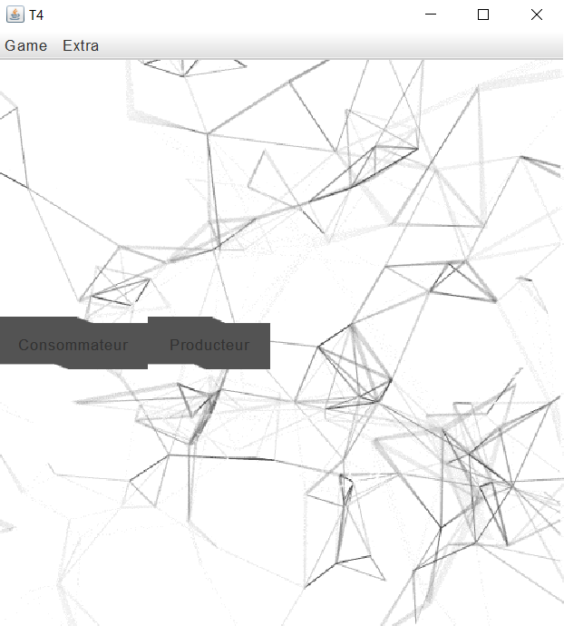
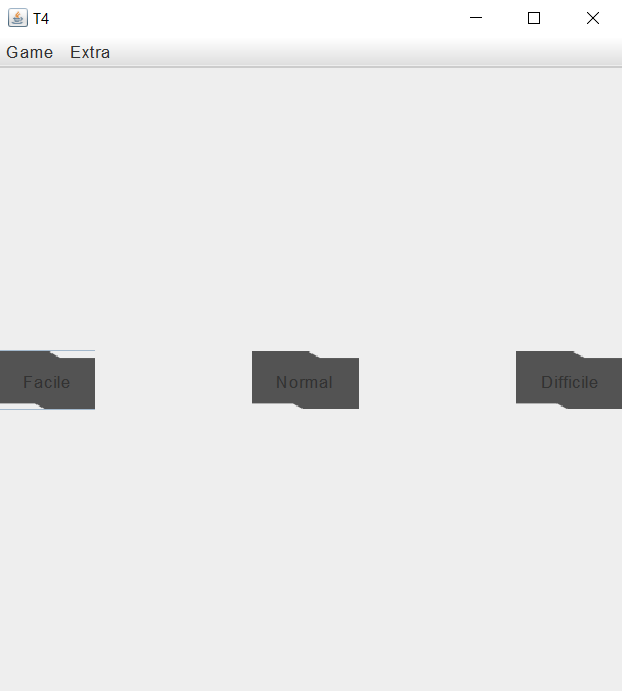
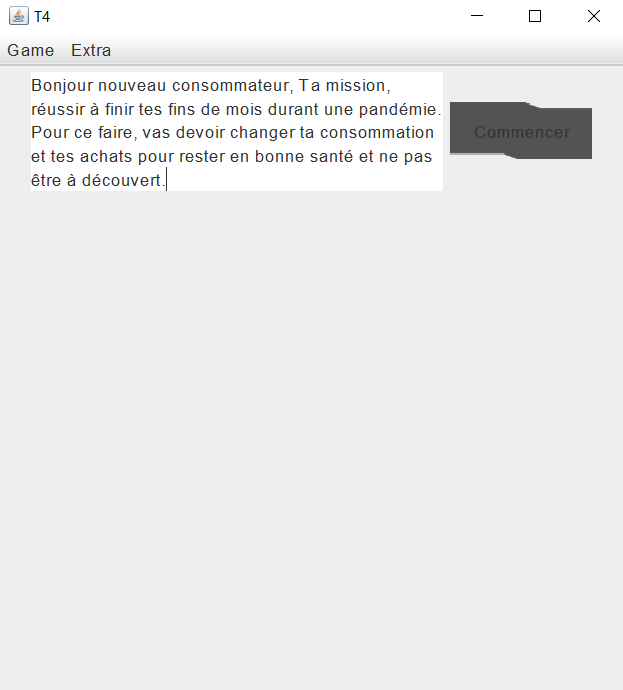
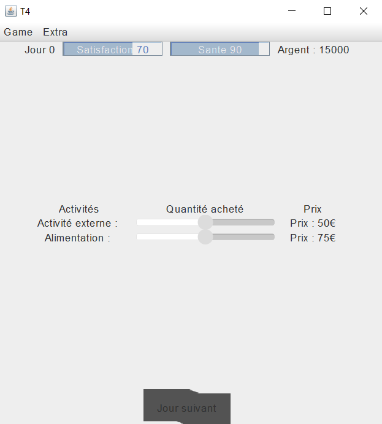
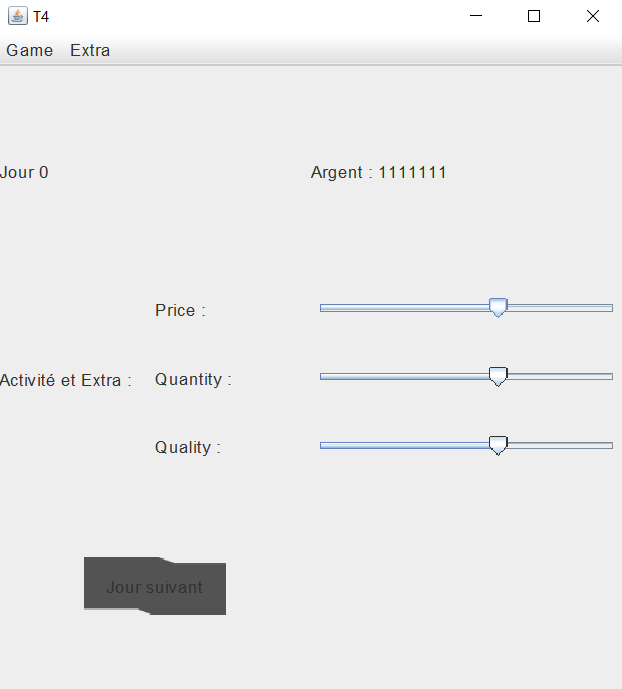

# Projet T4

## Auteurs

Ethan FUCHS, Jonathan GRILL, Gatien WILLEM--LEVRIER, Yuri SMOLIAK

## Cahier des charges

Vous pouvez prendre connaissance de notre [cahier des charges](https://docs.google.com/document/d/14A5H45h0aeqOCLblkzOGqaEBRMaSkllVMBdPrN6GaLk/edit?usp=sharing) pour avoir plus d'information sur notre application

## Grille d'évaluation

- [Grille d'évaluation](Evaluation-T4.md)
- [Victor Sanzovo](evaluationT2/Evaluation-T4-Victor-Sanzovo.md)

## Présentation du jeu

### Description
Dans ce jeu, vous pouvez incarner un gérant de pizzeria ou une tendance des consommateurs.  
Quand on est consommateur, on doit gérer la santé, l'argent et le bonheur grace à nos économies.  
Cependant La crise va vous toucher et il va falloir survivre.  
Si l'on a choisi le gérant, le but est simple: ne pas faire faillite.  
Bonne chance.  

### Images du jeu

Menu du jeu :

Le choix de la difficulté : 

Le scénario du jeu : 

Une partie lorsqu'on est un consommateur : 

Une partie lorsqu'on est un producteur : 

## Installation

Il vous suffit de cliquer [sur ce lien](https://git.unistra.fr/t43/t4/-/blob/main/Game/SimulMarket.jar) pour télécharger un éxécutable en .jar à lancer afin de jouer à notre jeu.

