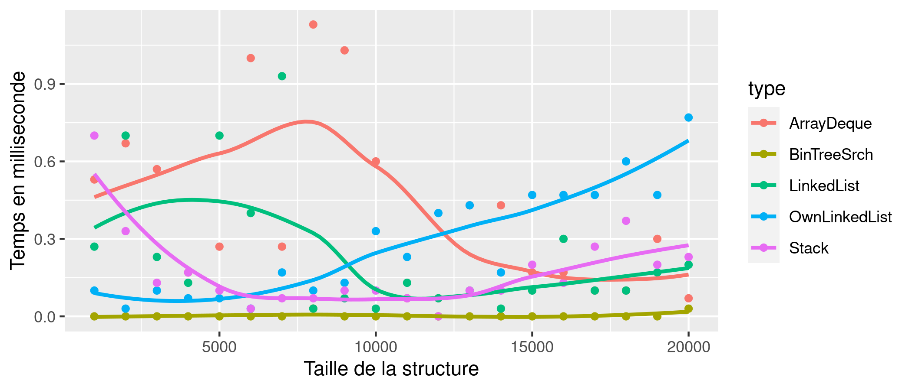
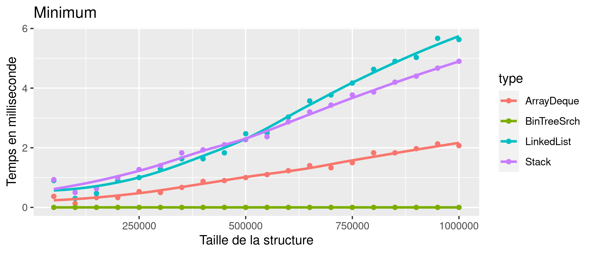
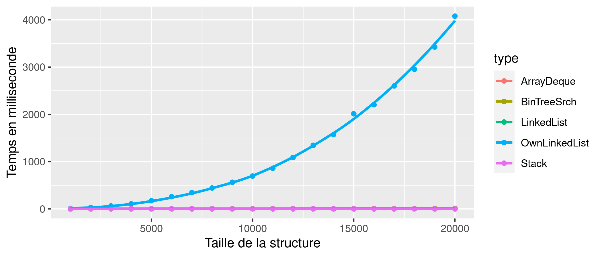
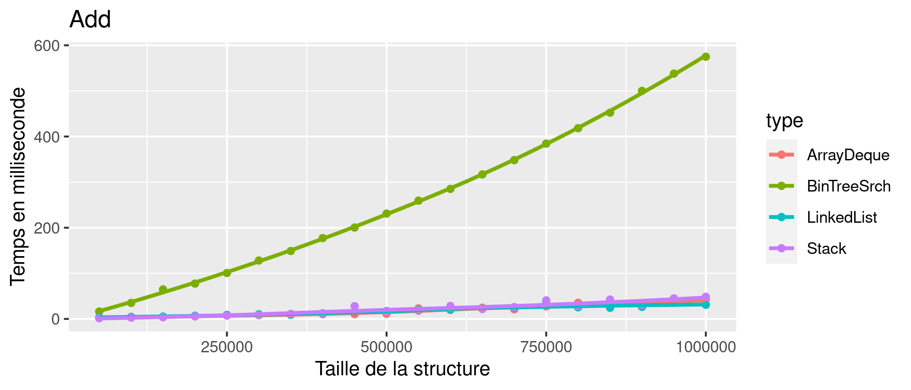
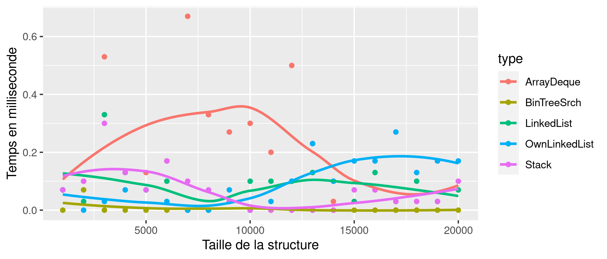
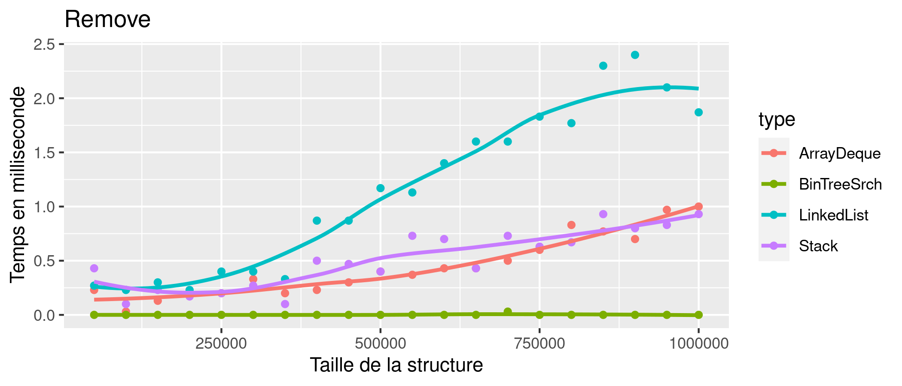
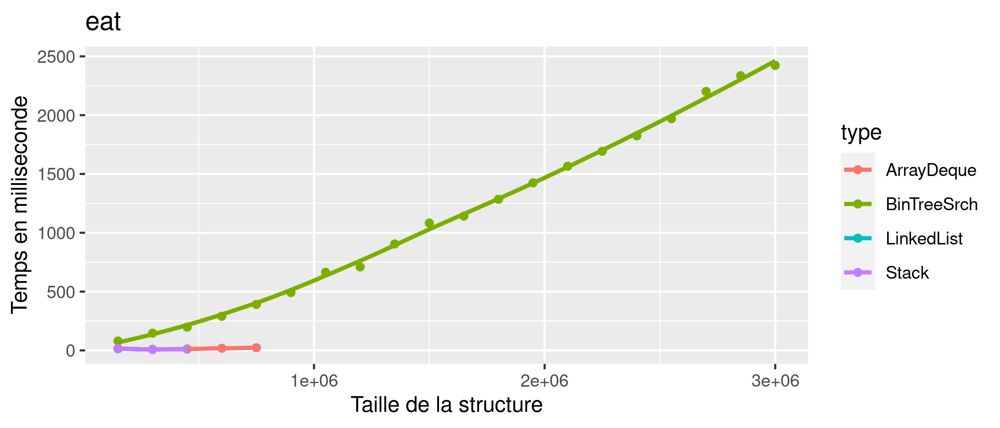
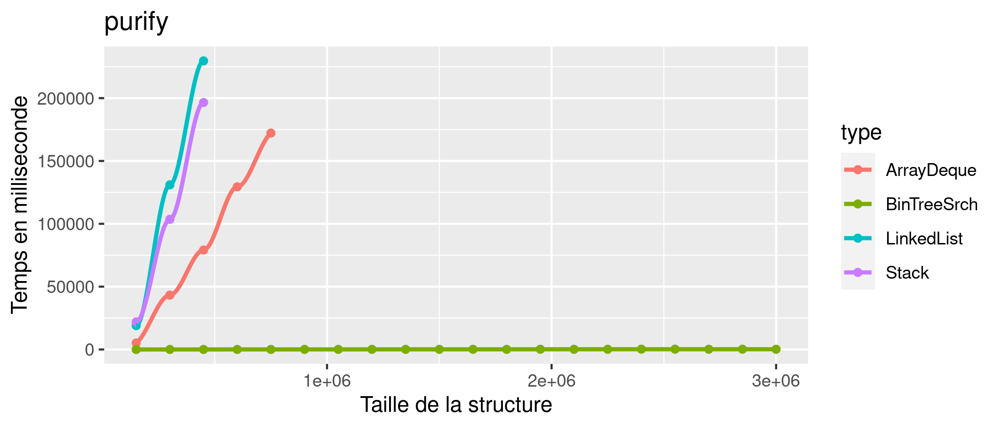
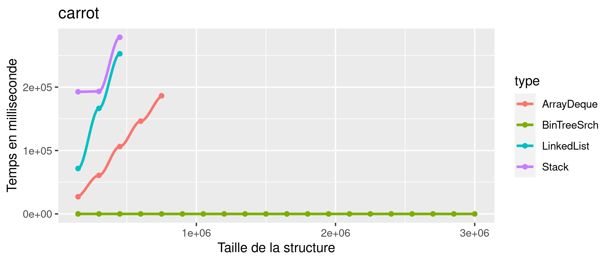

# P4a : analyse de performances

## Problème

Nous devons tester le temps mit par chaque structure pour certaines méthodes (add, min, remove et plus) pour comparer leur performance.

## Dispositif expérimental

### Application

[code source de l'application](https://git.unistra.fr/ethan.fuchs/p4a_2022/-/tree/main/source)
```
Notre application permet de tester des méthodes pour chaque structure, de calculer le temps que cela prend puis de tout mettre dans un fichier csv afin de pouvoir afficher des graphiques avec R, ce qui permettra de comparer les différentes structures.
Notre application utilise 3 arguments, le premier est le nombre d'échantillons, c'est-à-dire le nombre de fois qu'il va répéter
l'expérience pour en faire une moyenne (il faut au minimum 30 échantillons pour que le résultat soit significatif).
Le deuxième argument est le nombre de points, c'est-à-dire le nombre de répétitions en incrémentant à chaque fois la taille des
différentes structures.
Le troisième argument est l'incrémentation du nombre d'éléments dans la structure à chaque répétition.
```

### Environnement de test

```
Voici les informations sur le cpu de l'environnement sur lesquels les tests ont été effectué :
Architecture :                          x86_64
Mode(s) opératoire(s) des processeurs : 32-bit, 64-bit
Nom de modèle :                         Intel(R) Xeon(R) CPU E5-2630L v3 @ 1.80GHz
Vitesse du processeur en MHz :          1562.465
```

### Description de la démarche systématique

```
Le seul script à exécuter pour produire des données est convert.sh avec 3 arguments, ce script va directement exécuter le main est
mettre le résultat dans un csv puis lancer un autre script R pour faire les graphiques.
```

## Résultats préalables

### Temps d'exécution

| Jeu de test          | Toutes les structures (1 000 à 20 000 valeurs) | Structure sans ICOwnLinkedList (50 000 à 1 000 000 valeurs) |
|----------------------|----------------------------------------------|----------------------------------------------------------|
| minimum              |  |        |
| add                  |  |        |
| remove               |  |     |

### Temps d'exécution ex 7

| Jeu de test                | Toutes les structures (150 000 à 3 000 000 valeurs) |
|----------------------------|-----------------------------------------------------|
| eat                        |                       |
| purify                     |                    |
| carrot                     |                    |


### Analyse des résultats préalables

#### Ex 6

```
Nous avons d'abord fait des mesures sur nos 5 structures avec une incrémentation de 1 000 éléments jusqu'à 20 000. On a choisi une
incrémentation de 1 000 car la structure ICOwnLinkedList utilise de la récursivité et ne fonctionne plus à partir de 30 000 éléments.
Cependant, cette structure est exponentielle pour la fonction Add et nous empêche d'observer correctement les autres structures, c'est
pour cela que nous avons choisi d'enlever cette structure qui n'est pas du tout performant et faire des tests sur les autres
structures avec des éléments de 50 000 à 1 000 000.
Dans de ces résultats, nous observons que la structure ICBinaryTreeSaerch n'est pas du tout performante pour la fonction Add, il met
plus de 550 ms pour 1 million d'éléments, ce qui est largement au-dessus des autres qui sont tous vers le 50ms. Il met autant de temps car il
utilise de la récursivité. Cependant, il est très efficace lors de la recherche du minimum, car son minimum se trouve dans l'arbre le
plus à gauche, ce qui est dans le pire des cas tous les éléments, mais en réalité n'est qu'une petite partie de ces éléments et il est aussi très
efficace pour la fonction remove puisque cette méthode est faite à chaque fois sur le minimum.
Pour ce qui est des 3 autres structures que l'on n'a pas implémentées soi-même, il semblerait qu'ArrayDeque est le plus efficace globalement, même
si pour la recherche du minimum et le remove, il est plus lent comparé à ICBinaryTreeSaerch, avec respectivement un temps de 2ms et 1ms.
Pour ICLinkedList, il est le moins efficace parmi toutes les autres structures pour chaque méthode. Cependant, il est quand même plus efficace
qu'ICStack pour la recherche du minimum avec des valeurs inférieures à 550 000 éléments, de même que pour le remove comparé avec ICArrayDeque pour
des valeurs inférieures à 750 000 environ.
On observe sur les graphes qu'ICStack est une structure linéaire, le temps qu'elle met est proportionnel au nombre d'éléments qu'elle a.
Pour ICLinkedList, son temps augmente énormément pour un grand nombre d'éléments, elle est exponentielle. Enfin, ICArrayDeque, est plus performant
pour un grand nombre d'éléments.
```

#### Ex 7

```
La structure la plus intéressante pour effectuer les opérations eat, purify et carrot et ICBinaryTreeSaerch. Même s'il met beaucoup de temps pour la
fonction eat à cause de l'ajout des éléments, les autres méthodes purify et carrot qui ne font que remove des valeurs minimums ou maximum est presque
instantané puisque ces valeurs se trouve soit tout à gauche soit tout à droite de l'arbre.
Pour ce qui est des autres structures, les méthodes purify et carrot prenne beaucoup trop de temps, c'est pour cela que l'on a mis une limite et
arrête de faire des tests sur la structure si celle-ci dépasse 5 minutes.
```

### Limites des résultats préalables et ouvertures

```
Nous faisons les tests sur un nombre limité de structures, d'autres structures existantes peuvent être plus performantes que celle choisie. De plus nous faisons uniquement des tests sur un nombre limité d'éléments, on ne peut que deviner la suite des résultats sans être sûre de comment vont progresser les structures.
Les résultats reçus seront aussi différents en fonction des machines sur lesquels on fait les tests et de la façon dont on a implémenté nos structures. 
```

## Argumentaire

Vente de rêve à insérer ici

De toutes les structures testées, ICBinaryTreeSaerch nous semble être la meilleure structure, c'est la seule structure qui classe les éléments dès
leurs ajouts, ce qui simplifie énormément la recherche de ces éléments lorsque l'on utilise des méthodes.
Les autres structures semblent être plus efficaces en fonction du nombre d'éléments présents dans la structure puisque certains augmentent leur temps de façon exponentielle pendant que d'autres augmentent de façon logarithmique.
