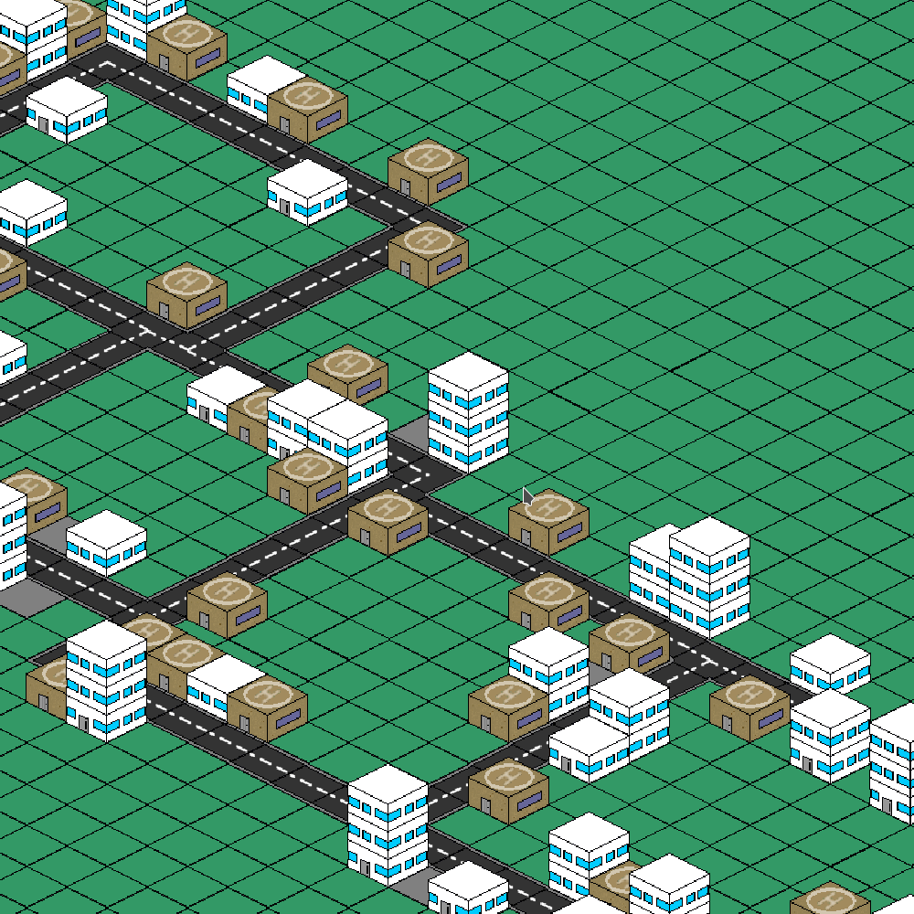

# T3 - 3 détraqués

**Contexte :** Basé sur les travaux d'une thèse d'une tutrice pédagogique, réaliser un prototype de jeu sérieux permettant d'apprendre ce que le tuteur a expliqué.  
**Thème :** Problématiques rencontrées lors de projets de rénovation urbaine dans les quartiers sociaux.  
**Durée de développement :** n jours.  
 
# Description des objectifs pédagogiques du jeu
## **Objectif pédagogique général**

 Le jeu se déroulera dans le cadre d'un quartier fictif à rénover : 
 
 - L'objectif principal est de faire comprendre aux joueurs que la rénovation urbaine est confronté à de nombreux problèmes d'ordre politique ou social qui dépassent le simple problème des moyens.

## **Description des paramètres de réussite de la rénovation**
- La satisfaction de la population durant et post-rénovation est importante à prendre en compte. En effet, dans un premier temps, les habitants accepteront toutes les rénovations du joueur. Puis, après un certain temps, si la satisfaction initial est plus importante que la satisfaction actuelle, les habitants seront plus enclin à refusé.
- Le Score aussi aura son importance durant la partie. En effet, à part le fait d'être le facteur de victoire du joueur, il servira aussi à aqcuérir l'accord de l'administration de la mairie. Ainsi, de la même manière qu'avec la satisfaction des hâbitants, la mairie acceptera toutes les rénovations du joueur jusqu'à un certain point, à partir duquel elle regardera le score par rapport au score initial.
- La qualté de vie est aussi un facteur important pour savoir si la rénovation d'un quartier est réussi. En effet, le facteur santé correspond à la santé du quartier (l'accès aux services de santé, la propreté du quartier, la sécurité, la pollution). C'est une manière de voir si cela a été efficace puisque le but d'une rénovation urbaine est d'améliorer la vie des habitants d'un quartier surtout dans les quartiers sociaux.
- Enfin, lorsque le joueur acceptera une mission il aura un briefing qui lui expliquera pourquoi la rénovation du quartier ce fait. En effet, il semble important de lui apprendre pourquoi une rénovation se fait la où elle à lieu.

# Description du jeu
- **Type de jeu** : Gestion en 2D isométrique
- **Incarnation du joueur** : Un maire omnipotent (Comme dans SimCity)
- **Nom du Jeu ** : MYN (Manage your Neighbourhood)

## **Déroulement d’une partie**
- Menu de démarrage (Jouer ou Quitter le jeu ainsi que Briefing)
- Différent choix de batiment à rénover, avec des conséquences différentes au cours du temps
- Les différentes statistiques évoluent au fur et à mesure servant d'indicateur au joueur pour savoir si il va dans la bonne direction
- Résultat de la rénovation et affichage d'un score final indiquant au joueur à quel point la mission confié a été réussi (l'objectif n'est pas d'avoir un écran de perte ou de réussite mais de montrer au joueur qu'il peu mieux faire,le risque de plusieurs échec étant que le joueur quitte le jeu, tandis qu'un esprit d'amélioration constant devrait le motiver). La fin de la rénovation se produira lorsque le temps donné au joueur sera écoulé ou que son budget (si il a choisi d'en avoir un) sera épuisé.

## Une capture d'écrand de notre jeu :

 />
